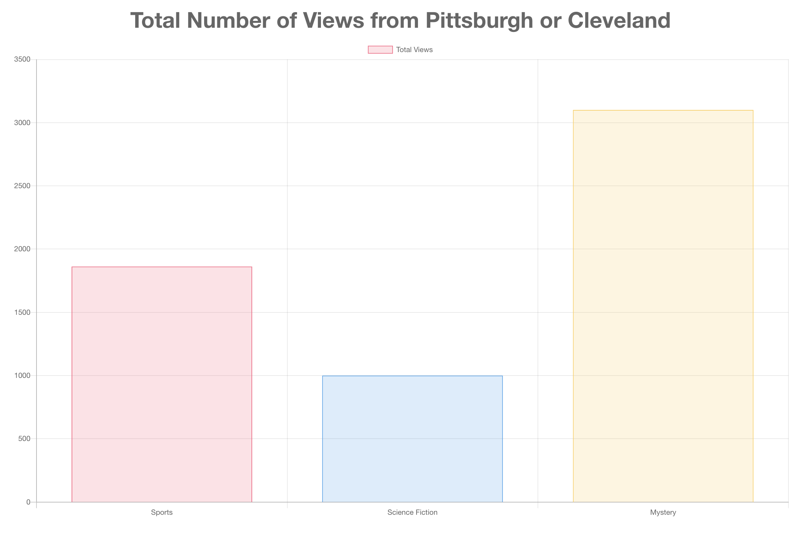

# Program Views

[Deployment](https://program-views.netlify.app/)

## Description

This app helps you show the total number of views from Pittsburgh or Cleveland by genre.

## Technologies

This app was made using react. Chart js was used as the library to display the information as a bar chat. d3 was used to load the csv file.

## Testing

Run "npm test" to test the components for this app.
